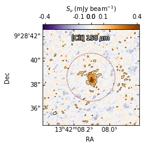
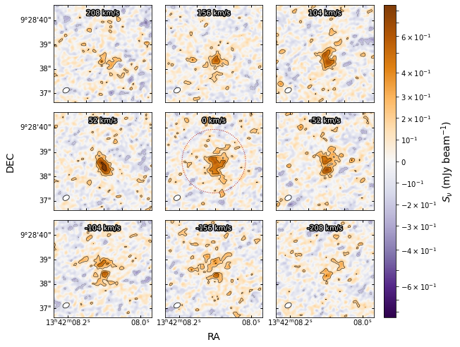
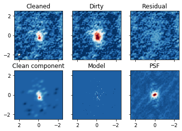
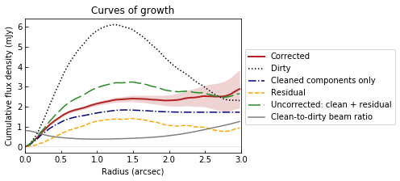
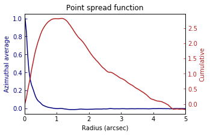

# Interferopy

A Python library of common tasks used in the observational radio/mm interferometry data analysis. 

The package was developed to aid in the studies of the interstellar medium in high-redshift quasar host galaxies using emission lines, as well as to create publication quality plots.

## Installation

Download the code, enter the interferopy folder and run

    python setup.py install
    
Or, alternatively, install directly from the repository with 

    python -m pip install git+https://github.com/mladenovak/interferopy

## Usage

Two classes, *Cube* and *MultiCube*, are defined in [cube.py](src/cube.py) with the goal to speed up the analysis of 2D or 3D data cubes, which are produced by imaging the interferometric data. A collection of helper functions are also available in [tools.py](src/tools.py). Enable their functionality by importing them.
    
    from interferopy.cube import Cube, MultiCube
    import interferopy.tools as iftools

### Cube

Open a single data cube saved in fits format with

    cub = Cube("image.fits")
   
**A 2D map is also considered a 3D cube, only with a single channel.**
The Cube object gives quick access to useful properties and functions, for example

    cub.freqs  # list of frequencies for each channel
    cub.vels  # list of velocities for each channel [optionally provide a reference frequency]
    cub.rms  # compute and return noise rms in each channel (usual units are Jy/beam)
    cub.beam  # beam sizes (resolution in arcsec), e.g., cub.beam["bmaj"]
    cub.pixsize  # pixel size in arcsec
    
Access to the image data is provided via

    cub.im  # image, entire data cube
    cub.im[px, py, ch]  # a pixel value in a specific channel (one voxel)
    cub.im[px, py, :]  # single pixel spectrum along the cube
    cub.im[:, :, ch]  # 2D map of a single channel
    cub.head  # original fits image header
    
Converting between pixel and celestial coordinates (usually equatorial coordinate system, in the ICRS or J2000 epoch) is performed with

    cub.wcs  # world coordinate system object
    px, py = cub.radec2pix(ra, dec)  # pixel to ra/dec coordinates (degrees)
    ra, dec = cub.pix2radec(px, py)
    ch = cub.freq2pix(freq)  # pixel (channel) to frequency coordinates
    freq = cub.pix2freq(ch)

Extract aperture flux density with the *spectrum()* method, for example

    flux, err, _ = cub.spectrum(ra=ra, dec=dec, radius=1.5, calc_error=True)
    
Omitting the coordinates assumes the central pixel position, which is useful for a quick look at the data, especially in targeted observations, where the source is usually in the phase center. Setting the radius to zero yields a single pixel spectrum. Additional convenience wrapper functions exist (derived from the *spectrum()* method).

    flux = cub.single_pixel_value()  # returns value(s) at the central pixel
    flux = cub.aperture_value(ra=ra, dec=dec, radius=0.5)  # integral within a circular aperture of r=0.5"
    flux, err = cub.aperture_value(ra=ra, dec=dec, radius=0.5, calc_error=True)
    
To find the best aperture size that encompasses the entire source, one can search for a saturation point in the curve of growth (cumulative flux density as a function of aperture radius). Obtain it with the *growing_aperture()* method.
This operates on a single channel only (must set the *freq* or the *channel* parameter). The same function implements the ability to compute azimuthally averaged radial profile.

    r, flux, err, _ = cub.growing_aperture(ra=ra, dec=dec, freq=freq, maxradius=5, calc_error=True)
    r, profile, err, _ = cub.growing_aperture(ra=ra, dec=dec, freq=freq, calc_error=True, profile=True)
    
Again, convenience wrapper functions exist (derived from the *growing_aperture()* method).

    r, flux = cub.aperture_r()  # use the central pixel, the first channel, and the maxradius of 1" by default
    r, profile = cub.profile_r()

### MultiCube

During the imaging process (e.g., using CASA task *tclean*), several cubes are produced, which all pertain to the same dataset and the same observed source.
The *MultiCube* is a container, a dictionary-like class that can hold multiple cubes simultaneously. This class also defines functions that operate on multiple cubes, such as the primary beam correction or the rasidual scaled aperture integration. Loading the *MultiCube* object is performed  with

     mcub = MultiCube("image.fits")
     
If a specific naming convention is used, it will load automatically other available cubes in the same directory, such as the *image.dirty.fits*, *image.residual.fits*, *image.pb.fits*, and so on. This behavior can be overriden, and the cubes can be loaded manually

     mcub = MultiCube("image.fits", autoload_multi=False)  # open the first map
     # mcub = MultiCube()  # alternatively, intialize an empty container
     # mcub.load_cube("/somewhere/cube.fits", "image")
     mcub.load_cube("/elsewhere/cube.dirty.fits", "dirty")
     mcub.load_cube("/elsewhere/cube.residual.fits", "residual")

Specific cubes are accessed via their keys:
    
    mcub.loaded_cubes  # list of loaded cubes
    cub = mcub["image"]  # return a Cube object
    cub = mcub.cubes["image"]  # same as above

Analogous to *spectrum()* and *growing_aperture()* methods available for a *Cube* object, 
the *MultiCube* object has *spectrum_corrected()* and *growing_aperture_corrected()*. These methods perform aperture integration that takes into account the ill-defined hybrid units of the cleaned maps. They require loaded *image*, *residual*, and *dirty* cubes (best to have the *pb* cube as well). 

    flux, err, tab = mcub.spectrum_corrected(ra=ra, dec=dec, radius=1.5, calc_error=True)
    r, flux, err, tab = mcub.growing_aperture_corrected(ra=ra, dec=dec, maxradius=5, calc_error=True)

These methods perform both the residual scaling correction, and the primary beam correction (can be turned off with *apply_pb_corr=False*). The *tab* will contain a *Table* object with additional technical information, such as the aperture integrated values from individual cubes, the clean-to-dirty beam ratio, number of pixels or beams in the aperture, and so on.

### Tools

Additional helper functions are defined in [tools.py](src/tools.py), for example

    iftools.sigfig(1.234, digits=3)  # rounds to 3 significant digits yielding 1.23
    iftools.calcrms(cub.im)  # calculate noise rms of the input array
    iftools.gausscont(x, cont, amp, freq0, sigma)  # Gaussian on top of a constant continuum profile

Various converter functions are defined here, for example

    width_ghz = iftools.kms2ghz(width_kms, freq_ghz)  # channel width in km/s to GHz at the reference frequency
    fwhm = iftools.sig2fwhm(sigma)  # convert Gaussian sigma to FWHM
    kpc_per_arcsec = iftools.arcsec2kpc(z)  # 1 arcsec to kiloparsecs using concordence cosmology
    ra, dec = iftools.sex2deg(ra_hms, dec_dms)  # sexagesimal coordinates h:m:s and d:m:s (strings) to degrees
    
Additionally, there are several methods used for dust continuum calculations: *blackbody()* - Planck's law, *dust_lum()* - compute dust luminosity, *dust_sobs()* - compute observed flux density of dust. 
A method to compute the surface brightness temperature of radio observations: *surf_temp()*.
A method to stack different positions in a single 2D map: *stack2d()*, and others.

### Miscellaneous

Several specialized tasks and helper functions for data reduction in CASA are located in [casatools.py](src/casatools.py) and [casatools_vla_pipe.py](src/casatools_vla_pipe.py).

## Examples

Usage of *Cube* and *MultiCube* classes, and their methods, are demonstrated on an ALMA dataset of a high-redshift quasar host galaxy J1342+0928, nicknamed **Pisco** for short. The galaxy host was observed across multiple ALMA bands between 100 and 400 GHz, targeting numerous atomic and molecular emission lines. The results and the method details are published in [Novak et al. (2019)](https://ui.adsabs.harvard.edu/abs/2019ApJ...881...63N/abstract) and [Bañados et al. (2019)](https://ui.adsabs.harvard.edu/abs/2019ApJ...881L..23B/abstract). For more technical details, see also [Novak et al. (2020)](https://ui.adsabs.harvard.edu/abs/2020ApJ...904..131N/abstract), where a similar analysis was performed on a larger sample of galaxies.

For the following demonstration, the high resolution data targeting the \[CII\] atomic fine structure line is used. Data cubes are located in the [data](examples/data) folder.
The complete code used to generate the paper quality figures, which are shown below, is available in the [examples.py](examples/examples.py).

### 2D map of the emission line

* Plot the integrated \[CII\] line emission centered on the given coordinate. Overlay logarithmic contours, the clean beam (in the bottom left corner), and the aperture circle.\

* In a different style with lin-log scaling and wcs axes (also works for continuum maps).\

* Plot the curve of growth extracted from the above map. Scale the units to line flux density (Jy km/s) and provide a physical distances axis. The residual scaling correction accounts for a non-negligible 35% systematic error.\

### 3D data cube: channel maps and spectrum

* Plot channel maps around the peak line emission (set to be at velocity of 0 km/s). The grid size is easily changed to include more or fewer panels.\
 

* Or, again, in lin-log scaling and wcsaxes, and more accessible to people with colour-blindness.
 

* Plot the aperture integrated spectrum extracted from the above cube. Perform residual scaling correction. Fit a Gaussian plus a continuum to estimate the line parameters.\
 

### Technical plots 

* Plot various maps generated during the cleaning process. The cleaned map is the sum of the residual map (units of Jansky per dirty beam, which is the PSF) and the clean component map (units of Jansky per clean beam, which is a Gaussian), and therefore suffers from ill-defined units. Residual scaling method correct for this issue by estimating the clean-to-dirty beam ratio (epsilon).\
 

* Plot the curves of growth from various maps and show the residual scaling correction in effect.\
 

* Show the profile (azimuthal average) and the curve of growth (cumulative) of the dirty beam (the PSF). The resolution in the map can be defined to be the FWHM of the PSF profile.
Note how the cumulative integral of the dirty beam approaches zero at large radii, causing the units in the residual map to become undefined (Jy / dirty beam).\
 

 * Plot the aperture integrated spectrum derived from multiple maps. Use the high signal-to-noise channels (those with line emission) to fix the clean-to-dirty beam ratio for all channels.\
 

### Cheers!
Enjoy one pisco coctail, surrounded by dust, bubbling with CO, and with a twist of CNO elements!

## Licence
MIT License, Copyright (c) 2020 Mladen Novak
