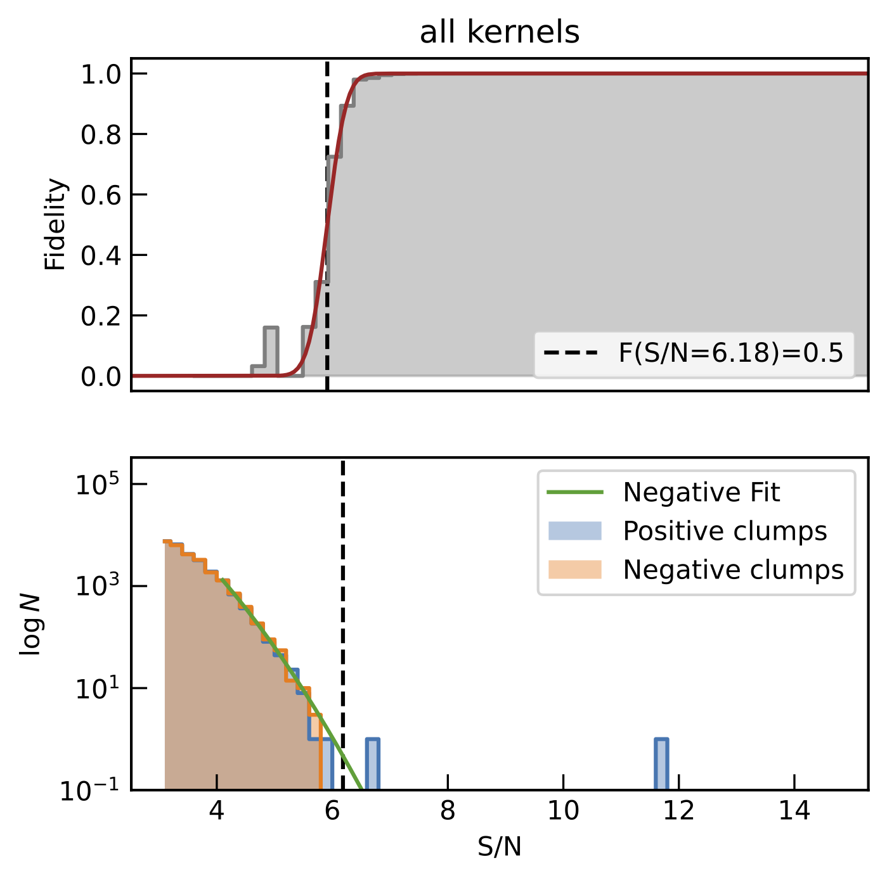

Finding line emitters with Findclumps
=====================================

Interferopy includes an implementation of the Findclumps algorithm
used by `Walter et al. 2016 (ApJ, 833, 67W)
<https://ui.adsabs.harvard.edu/abs/2016ApJ...833...67W/abstract>`_  to
find line emitters in ASPECS.  At its core, Findclumps simply
convolves the cube with boxcar kernels of various sizes, and run
sextractor on the created image to find "clumps". It does so on the
original and inverted cubes, enabling the user to estimate which
detections are real or not. It groups "clumps" by frequency and
spatial distance, at the discretion of the user.  After a list of
positive and negative candidates has been constructed, the fidelity is
determined in SN space for each kernel and for all kernels combined.

To run FindClcumps, you will need to have sextractor installed (which
can be done via an astroconda environment :
https://astroconda.readthedocs.io/en/latest/package_manifest.html),
and have a local "default.sex" file in the folder where you run the
interferopy-findclumps script. You can either copy your generic
default.sex that comes as part of sextractor of modify it to optimise
the search for "clumps" in the cube.

Example usage:

.. code-block:: python

    import numpy as np
    from interferopy.cube import Cube
    cube = Cube('absolute_path/filename')
    catP, catN, candP, candN = cube.findclumps_full(output_file='findclumps_',
                                                    kernels=np.arange(3, 20, 2),
                                                    run_search=True,
                                                    run_crop=True,
                                                    SNR_min=3,
                                                    delta_offset_arcsec=2,
                                                    delta_freq=0.1,
                                                    run_fidelity=True,
                                                    fidelity_bins=np.arange(0, 15, 0.2),
                                                    min_SN_fit=4.0, fidelity_threshold=0.5,
                                                    verbose=True,
                                                    sextractor_param_file = '',
                                                    ncores=1)

This will run the search for kernels of 3 up to 19 channels, crop the
sources at S/N > 3 that fall within 2 arcseconds and 0.1 GHz (starting
from the highest S/N sources), do the fidelity analysis on the S/N > 4
candidates in delta S/N of 0.2 bins, returning the full positive and
negative catalogs and those only keeping sources above a fidelity
threshold of 0.5 (per kernel width).  For more information, see the
documentation of :any:`interferopy.cube.Cube.findclumps_full` and the
individual functions for more details.

#### Sextractor parameter files
Default Sextractor files (.sex,.param)  are distributed with interferopy.
The default.param cannot be changed because the code expects a fixed
number ofcolumns with a certain order in the intermediate Sextractor
catalogues. MINTHRES/MINAREA/DETECT_THRES parameters are set to 3, as we
find this works well for most applications and observatories. If you wish
to change these parameters, the filename of the .sex file in the
'sextractor_param_file' parameter. We note that high SNR and area thresholds
accelerate findclumps but make the fitting of the SNR distribution and the
fidelity more unstable as the low-SNR distribution is not constrained.

The resulting fidelity selection plot should look like this:

