Plotting Examples
=================

Usage of :any:`Cube` and :any:`MultiCube` classes, and their methods, are demonstrated on an ALMA dataset of a high-redshift quasar host galaxy J1342+0928, nicknamed **Pisco** for short. The galaxy host was observed across multiple ALMA bands between 100 and 400 GHz, targeting numerous atomic and molecular emission lines. The results and the method details are published in `Novak et al. (2019) <https://ui.adsabs.harvard.edu/abs/2019ApJ...881...63N/abstract>`_ and `Bañados et al. (2019) <https://ui.adsabs.harvard.edu/abs/2019ApJ...881L..23B/abstract>`_. For more technical details, see also `Novak et al. (2020) <https://ui.adsabs.harvard.edu/abs/2020ApJ...904..131N/abstract>`_, where a similar analysis was performed on a larger sample of galaxies.

For the following demonstration, the high resolution data targeting the \[CII\] atomic fine structure line is used. Data cubes are available on github (https://github.com/interferopy/interferopy/tree/master/examples/data).
The complete code used to generate the paper quality figures, which are shown below, is available here https://github.com/interferopy/interferopy/blob/master/examples/examples.py .

2D map of the emission line
---------------------------

Plot the integrated \[CII\] line emission centered on the given coordinate. Overlay logarithmic contours, the clean beam (in the bottom left corner), and the aperture circle. The second plot is in a different style with lin-log scaling, wcs axes (also works for continuum maps), and is more accessible to people with colour-blindness.\

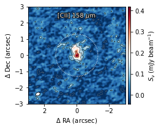
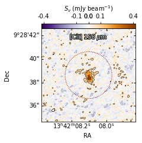

Plot the curve of growth extracted from the above map. Scale the units to line flux density (Jy km/s) and provide a physical distances axis. The residual scaling correction accounts for a non-negligible 35% systematic error.\

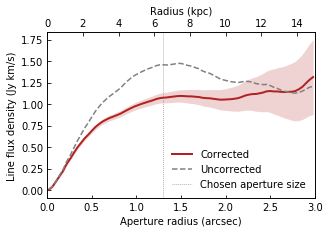

3D data cube: channel maps and spectrum
---------------------------------------

Plot channel maps around the peak line emission (set to be at velocity of 0 km/s). The grid size is easily changed to include more or fewer panels.\

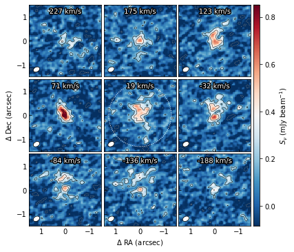

Or, again, in lin-log scaling and wcsaxes.

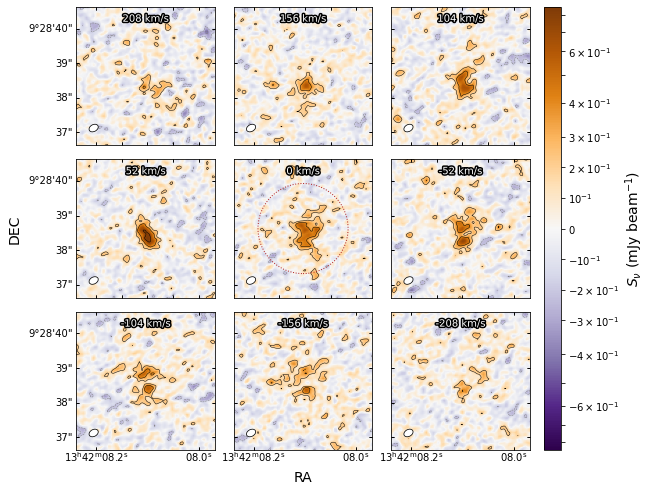

Plot the aperture integrated spectrum extracted from the above cube. Perform residual scaling correction. Fit a Gaussian plus a continuum to estimate the line parameters.\

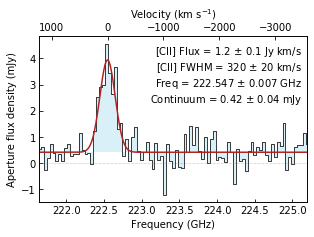

Fitting the dust continuum
--------------------------

Fit a modified black body emission to the observed dust continuum emission points. Takes into account the cosmic microwave background heating and contrast. Free fitting parameters are the dust mass, the dust temperature, and the spectral emissivity (slope beta), or a subsample of those. The dust mass affects the overall scaling, the temperature affects the peak position, and beta affects the Rayleigh-Jeans tail slope. The integral below the fitted curve is then converted to star formation rate. See :doc:`tools` or :any:`interferopy.tools` for further details.

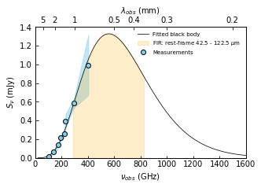

Technical plots
---------------

Plot various maps generated during the cleaning process. The cleaned map is the sum of the residual map (units of Jansky per dirty beam, which is the PSF) and the clean component map (units of Jansky per clean beam, which is a Gaussian), and therefore suffers from ill-defined units. Residual scaling method correct for this issue by estimating the clean-to-dirty beam ratio (epsilon).

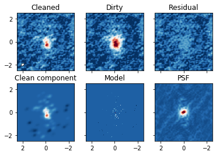

Plot the curves of growth from various maps and show the residual scaling correction in effect.

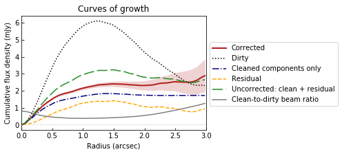

Show the profile (azimuthal average) and the curve of growth (cumulative) of the dirty beam (the PSF). The resolution in the map can be defined to be the FWHM of the PSF profile. Note how the cumulative integral of the dirty beam approaches zero at large radii, causing the units in the residual map to become undefined (Jy / dirty beam).

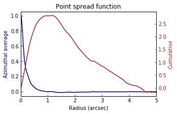

Plot the aperture integrated spectrum derived from multiple maps. Use the high signal-to-noise channels (those with line emission) to fix the clean-to-dirty beam ratio for all channels.

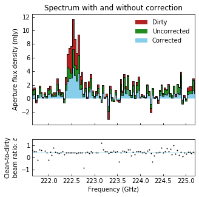
